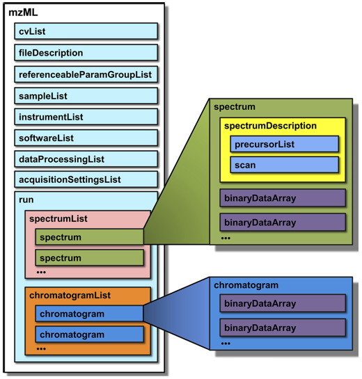

# mzdata

[![NPM version][npm-image]][npm-url]
[![build status][ci-image]][ci-url]
[![npm download][download-image]][download-url]

Read and explore xml files used to encode mass spectra.

This includes:

- mzData
- mzML
- mzXML

## Installation

`$ npm i mzdata`

This package is ESM-only. CommonJS consumers can still `require()` it on Node.js
≥ 22.12 or any 24.x and later, or switch to `import`.

## Usage

```js
import { readFileSync } from 'node:fs';

import { parseMZ } from 'mzdata';

// works the same for mzData, mzML and mzXML files
const file = readFileSync('tiny.mzData.xml');
const result = await parseMZ(file);

console.log(Object.keys(result));
// ['metadata', 'times', 'series']

console.log(result.times);
// [5.8905, 5.944667, 10]

// one entry per spectrum, each a [mass, intensity] pair of Float64Array
console.log(result.series.ms.data.length);
// 3
```

`parseMZ` accepts an `ArrayBuffer`, a `Uint8Array` (including Node.js `Buffer`)
or a `string`, detects the format from the file header, and throws
`MZ parser: unknown format` if it is none of mzData, mzML or mzXML.

### Options

| Option    | Type          | Default   | Description                                                                                              |
| --------- | ------------- | --------- | -------------------------------------------------------------------------------------------------------- |
| `logger`  | `Logger`      | `console` | A [`cheminfo-types`](https://github.com/cheminfo/cheminfo-types) logger, used to report decoding errors. |
| `rawData` | `ArrayBuffer` | —         | imzML only: the content of the companion `.ibd` file holding the binary spectra.                         |

### imzML

An imzML file stores its spectra in a separate `.ibd` file, passed as `rawData`.
The result then also carries `xPositions` and `yPositions`, one entry per
spectrum:

```js
const result = await parseMZ(imzML, { rawData: ibd });
console.log(result.xPositions.length, result.yPositions.length);
```

## History of formats

https://dx.doi.org/10.1074/mcp.R110.000133

- mzData was developed by HUPO-PSI
  - http://psidev.info/index.php?qnode/80#mzdata
  - https://doi.org/10.1002/pmic.200300588
- mzXML was developed at the Institute for Systems Biology
- mzML: new unified output format started in 2006

mzML - 4 goals:

- creation of a simple format
- elimination of alternate ways to encode the same information
- support for all the features of both mzXML and mzData
- validation through implementation prior to release.



cv = Controlled Vocabulary

## Ontology

[Ontology](./ontology.md)

## More examples

You can find various examples files at:

http://www.psidev.info/mzML

## License

[MIT](./LICENSE)

[npm-image]: https://img.shields.io/npm/v/mzdata.svg?style=flat-square
[npm-url]: https://npmjs.org/package/mzdata
[ci-image]: https://github.com/cheminfo/mzData/actions/workflows/nodejs.yml/badge.svg?branch=main
[ci-url]: https://github.com/cheminfo/mzData/actions/workflows/nodejs.yml
[download-image]: https://img.shields.io/npm/dm/mzdata.svg?style=flat-square
[download-url]: https://npmjs.org/package/mzdata
